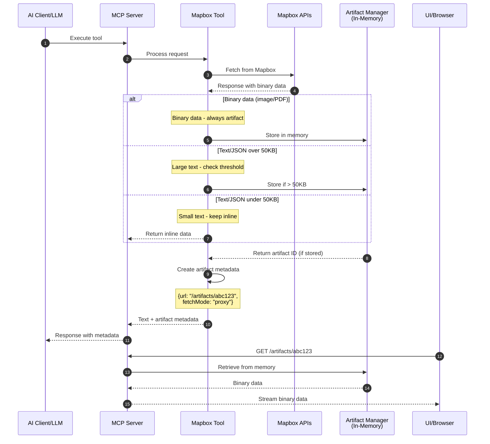
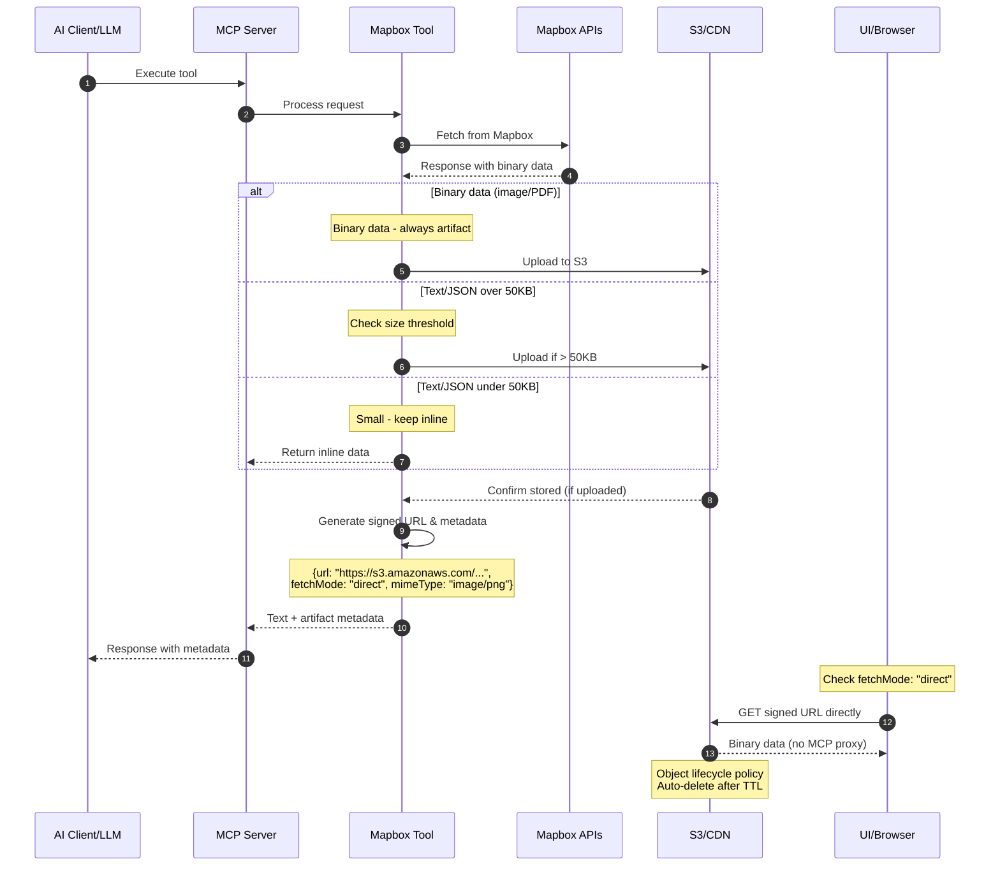
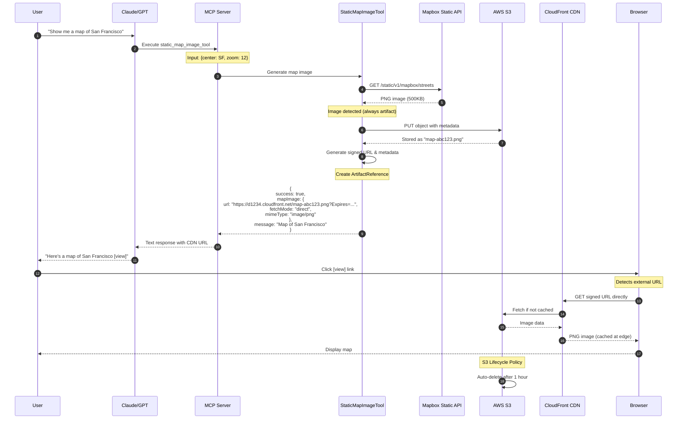

# Binary Artifact Separation Implementation Guide

## Overview

This guide describes how to use the binary artifact separation feature in the Mapbox MCP Server to optimize token usage when dealing with large binary data like images or GeoJSON.

## The Problem

Mapbox APIs return various types of data:
- **Text data** - Addresses, coordinates, place names, JSON responses
- **Binary data** - Static map images, PDFs, encoded files

Including binary data directly in LLM responses wastes tokens and can exceed context limits.

## The Solution

Separate ALL binary artifacts from text responses:
1. Store binary data in artifact manager (always, regardless of size)
2. Return artifact metadata with explicit fetch instructions
3. Let the UI fetch artifacts based on metadata, not URL parsing

## Architecture Overview

The system supports two modes for artifact delivery:

### Development Mode (Proxy)

In development, the MCP server proxies artifact requests from its in-memory storage:



### Production Mode (Direct Fetch)

In production, artifacts are served directly from S3/CDN without touching the MCP server:



### Key Differences

| Aspect | Development | Production |
|--------|------------|------------|
| Storage | In-memory | S3/CDN |
| URL Type | Relative (`/artifacts/...`) | Absolute (`https://...`) |
| Fetch Path | Through MCP server | Direct from S3/CDN |
| Scalability | Limited by server memory | Unlimited |
| Performance | Good for small files | Optimized with CDN edge |
| Setup | Simple, no external deps | Requires S3/CDN config |

## Artifact Metadata Schema

```typescript
// Artifact reference with explicit metadata
interface ArtifactReference {
  url: string;                    // The URL to fetch from
  fetchMode: 'direct' | 'proxy';  // How to fetch it
  mimeType: string;               // Content type
  expires?: string;               // Optional expiration (ISO 8601)
  size?: number;                  // Optional size in bytes
}

// Tool response with artifacts
interface ToolResponse {
  success: boolean;
  message: string;
  // Binary data as artifact references
  mapImage?: ArtifactReference;
  routeGeoJson?: ArtifactReference;
  // Text data stays inline
  address?: string;
  coordinates?: [number, number];
}
```

## Usage

### Basic Example

```typescript
import { getArtifactManager, ARTIFACT_SIZE_THRESHOLD_BYTES } from './services/binary-artifact-manager.js';

class StaticMapTool {
  async execute(input, accessToken) {
    // Fetch map image from Mapbox API
    const imageBuffer = await this.fetchMapImage(input, accessToken);
    
    // Always store images as artifacts (no size check)
    const manager = getArtifactManager();
    const artifactId = manager.store(
      imageBuffer,
      this.name,
      'image/png'
    );
    
    // Return response with artifact metadata
    return {
      success: true,
      message: 'Map generated successfully',
      mapImage: {
        url: manager.getUrl(artifactId),
        fetchMode: process.env.NODE_ENV === 'production' ? 'direct' : 'proxy',
        mimeType: 'image/png',
        expires: new Date(Date.now() + 3600000).toISOString()
      }
    };
  }
}
```

### When to Use Artifact Separation

**Always use artifacts for (no size threshold):**
- All images (PNG, JPEG, WebP, GIF, etc.)
- All binary files (PDF, ZIP, etc.)
- Audio/video files
- Base64-encoded binary data

**Use artifacts when exceeding 50KB threshold for:**
- Large GeoJSON geometries (e.g., complex routes, isochrones)
- Large CSV/TSV data files
- Extensive log files
- Any text/JSON response over 50KB

**Always keep inline (regardless of size):**
- Text responses under 50KB
- API error messages
- Simple coordinates and addresses
- Small JSON responses
- Data the LLM needs to analyze directly

## Implementation Details

### BinaryArtifactManager

The manager provides simple methods:

```typescript
interface BinaryArtifactManager {
  // Store binary data, returns artifact ID
  store(data: Buffer, tool: string, mime: string): string;
  
  // Get URL for accessing artifact
  getUrl(id: string): string;
  
  // Get fetch mode for current environment
  getFetchMode(): 'direct' | 'proxy';
  
  // Create complete artifact reference
  createReference(id: string, mimeType: string): ArtifactReference;
  
  // Retrieve artifact data (for proxy mode)
  get(id: string): StoredArtifact | null;
  
  // Delete artifact
  delete(id: string): void;
}
```

### Memory Management

- Artifacts have a TTL (default: 1 hour)
- Development: Automatic cleanup runs every minute
- Production: S3 lifecycle policies or CDN TTL headers

## Storage Backends

### 1. In-Memory Storage (Development)
```typescript
const manager = new BinaryArtifactManager();
const id = manager.store(data, tool, mime);
const url = manager.getUrl(id);
// Returns: "/artifacts/abc123"
```

### 2. S3 Storage (Production)
```typescript
const manager = new S3ArtifactManager({
  bucket: 'mapbox-artifacts',
  region: 'us-east-1',
  ttl: 3600  // 1 hour signed URL
});
const id = await manager.store(data, tool, mime);
const url = await manager.getUrl(id);
// Returns: "https://s3.amazonaws.com/mapbox-artifacts/abc123?X-Amz-Signature=..."
```

### 3. CDN Storage (Production Scale)
```typescript
const manager = new CDNArtifactManager({
  baseUrl: 'https://cdn.example.com',
  s3Backend: s3Manager,  // Upload to S3
  cdnInvalidation: true   // Trigger CDN pull
});
const id = await manager.store(data, tool, mime);
const url = await manager.getUrl(id);
// Returns: "https://cdn.example.com/artifacts/abc123?token=..."
```

### 4. Filesystem Storage (Self-Hosted)
```typescript
const manager = new FileArtifactManager({
  directory: '/var/www/artifacts',
  publicUrl: 'https://artifacts.example.com'
});
const id = await manager.store(data, tool, mime);
const url = manager.getUrl(id);
// Returns: "https://artifacts.example.com/abc123"
```

### URL Types and Client Handling

```typescript
// Client-side logic
function fetchArtifact(url: string) {
  if (url.startsWith('/')) {
    // Relative URL - fetch through MCP server
    return fetch(`${mcpServerBase}${url}`);
  } else {
    // Absolute URL - fetch directly
    return fetch(url);
  }
}
```

## Implementation Summary

### Decision Flow
```
1. Is it binary data (image/PDF/audio)?
   → YES: Always use artifact (no size check)
   
2. Is it text/JSON data?
   → Over 50KB: Use artifact
   → Under 50KB: Keep inline
```

### Global Threshold
```typescript
// Defined in binary-artifact-manager.ts
export const ARTIFACT_SIZE_THRESHOLD_BYTES = 50000; // 50KB
```

### Tool Implementation Status

| Tool | Output Type | Artifact Usage |
|------|------------|----------------|
| StaticMapImageTool | PNG/JPEG images | Always (binary) |
| DirectionsTool | GeoJSON routes | When > 50KB |
| IsochroneTool | GeoJSON polygons | When > 50KB |
| ForwardGeocodeTool | Addresses | Never (small text) |
| ReverseGeocodeTool | Addresses | Never (small text) |
| PoiSearchTool | POI lists | Rarely (usually < 50KB) |
| CategorySearchTool | Place lists | Rarely (usually < 50KB) |
| MatrixTool | Distance matrix | Never (numerical) |

## Best Practices

1. **Binary Always Artifacts** - All images/binary data become artifacts regardless of size
2. **Text Threshold Check** - Check ARTIFACT_SIZE_THRESHOLD_BYTES for text/JSON
3. **Explicit Metadata** - Always include fetchMode, mimeType in response
4. **MIME Types** - Always specify correct MIME type for proper handling
5. **Environment Awareness** - Set fetchMode based on deployment environment
6. **Cleanup** - Rely on automatic TTL cleanup (memory or S3 lifecycle)
7. **Error Handling** - Gracefully handle storage failures with fallbacks
8. **Include Summary** - When using artifacts, include a text summary inline

## Tool Implementation Guide

### Tools That ALWAYS Use Artifacts (Binary Data)

#### StaticMapImageTool
Generates PNG/JPEG images - always stored as artifacts:

```typescript
import { ARTIFACT_SIZE_THRESHOLD_BYTES } from './binary-artifact-manager.js';

class StaticMapImageTool {
  async execute(input, token) {
    const imageBuffer = await this.fetchMapImage(input, token);
    const manager = getArtifactManager();
    
    // Images ALWAYS become artifacts (no threshold check)
    const artifactId = manager.store(
      imageBuffer,
      'static_map_image_tool',
      'image/png'
    );
    
    return {
      success: true,
      message: 'Map generated',
      mapImage: manager.createReference(artifactId, 'image/png')
    };
  }
}
```

### Tools That Use Artifacts When Large (Text/JSON)

#### DirectionsTool
Returns route data - uses artifacts for large GeoJSON:

```typescript
class DirectionsTool {
  async execute(input, token) {
    const directions = await this.fetchDirections(input, token);
    const manager = getArtifactManager();
    
    // Check if GeoJSON exceeds threshold
    if (directions.geometry) {
      const geoJsonStr = JSON.stringify(directions.geometry);
      
      if (geoJsonStr.length > ARTIFACT_SIZE_THRESHOLD_BYTES) {
        // Large GeoJSON becomes artifact
        const geoId = manager.store(
          Buffer.from(geoJsonStr),
          'directions_tool',
          'application/geo+json'
        );
        
        directions.geometryArtifact = manager.createReference(geoId, 'application/geo+json');
        directions.geometrySummary = `Route geometry (${(geoJsonStr.length/1024).toFixed(1)}KB) available as artifact`;
        delete directions.geometry;
      }
      // Small GeoJSON stays inline
    }
    
    return directions;
  }
}
```

#### IsochroneTool
Returns reachable area polygons - uses artifacts for complex isochrones:

```typescript
class IsochroneTool {
  async execute(input, token) {
    const isochrone = await this.fetchIsochrone(input, token);
    const manager = getArtifactManager();
    
    // Check if polygon data exceeds threshold
    if (isochrone.features) {
      const geoJsonStr = JSON.stringify(isochrone);
      
      if (geoJsonStr.length > ARTIFACT_SIZE_THRESHOLD_BYTES) {
        // Large isochrone becomes artifact
        const isoId = manager.store(
          Buffer.from(geoJsonStr),
          'isochrone_tool',
          'application/geo+json'
        );
        
        return {
          summary: `Isochrone with ${isochrone.features.length} contours`,
          isochroneArtifact: manager.createReference(isoId, 'application/geo+json'),
          // Include key metadata inline
          contours: isochrone.features.map(f => ({
            time: f.properties.contour,
            area: f.properties.area
          }))
        };
      }
    }
    
    // Small isochrone stays inline
    return isochrone;
  }
}
```

### Tools That Keep Data Inline (Small Text)

These tools typically return small text responses that stay inline:

- **ForwardGeocodeTool** - Address lookups
- **ReverseGeocodeTool** - Coordinate to address
- **PoiSearchTool** - POI search results
- **CategorySearchTool** - Places by category
- **MatrixTool** - Distance/duration matrices

```typescript
class ForwardGeocodeTool {
  async execute(input, token) {
    // Returns small JSON with addresses - always inline
    return await this.geocode(input, token);
  }
}
```

### Example: Static Map Generation in Production

This diagram shows how a static map is generated and served directly from S3 in production:



### Security Considerations

1. **Signed URLs**: Temporary access with expiration
   ```typescript
   const signedUrl = s3.getSignedUrl('getObject', {
     Bucket: 'mapbox-artifacts',
     Key: artifactId,
     Expires: 3600  // 1 hour
   });
   ```

2. **CORS Configuration**: Allow browser direct access
   ```json
   {
     "AllowedOrigins": ["https://app.example.com"],
     "AllowedMethods": ["GET"],
     "MaxAgeSeconds": 3600
   }
   ```

3. **No Token Exposure**: Mapbox tokens never reach the browser
   - Tool fetches from Mapbox with server-side token
   - Only signed S3 URLs are exposed to client
   - Token remains secure on MCP server

## Testing

```typescript
import { resetArtifactManager } from './services/binary-artifact-manager.js';

beforeEach(() => {
  // Reset manager between tests
  resetArtifactManager();
});

test('should separate large artifacts', () => {
  const tool = new MyTool();
  const result = await tool.execute(largeImageInput);
  
  expect(result.imageUrl).toBeDefined();
  expect(result.image).toBeUndefined();
});
```

## Migration Strategy

### Phase 1: Development with In-Memory
- Start with simple `BinaryArtifactManager`
- Test artifact separation logic
- No external dependencies

### Phase 2: Staging with S3
- Implement `S3ArtifactManager`
- Test signed URL generation
- Configure CORS policies
- Validate direct browser fetching

### Phase 3: Production with CDN
- Add CloudFront or similar CDN
- Configure edge caching
- Implement cache invalidation
- Monitor performance metrics

### Backward Compatibility

The system maintains compatibility across versions:

```typescript
// Modern response with artifact metadata
{
  "success": true,
  "message": "Map generated successfully",
  "mapImage": {
    "url": "https://cdn.example.com/map.png",
    "fetchMode": "direct",
    "mimeType": "image/png"
  }
}

// Can include legacy fields for old clients
{
  "success": true,
  "message": "Map generated successfully",
  "mapImage": { /* artifact reference */ },
  "imageUrl": "https://cdn.example.com/map.png"  // Legacy field
}
```

## Client Implementation Examples

### JavaScript/TypeScript Client
```typescript
interface ArtifactReference {
  url: string;
  fetchMode: 'direct' | 'proxy';
  mimeType: string;
  expires?: string;
}

class ArtifactFetcher {
  constructor(private mcpServerUrl: string) {}

  async fetchArtifact(artifact: ArtifactReference): Promise<Blob> {
    // Use explicit fetchMode, not URL parsing
    if (artifact.fetchMode === 'direct') {
      // Fetch directly from S3/CDN
      return fetch(artifact.url).then(r => r.blob());
    } else {
      // Proxy through MCP server
      const fullUrl = `${this.mcpServerUrl}${artifact.url}`;
      return fetch(fullUrl).then(r => r.blob());
    }
  }

  async renderImage(artifact: ArtifactReference) {
    const blob = await this.fetchArtifact(artifact);
    const img = document.createElement('img');
    img.src = URL.createObjectURL(blob);
    img.setAttribute('data-mime-type', artifact.mimeType);
    document.body.appendChild(img);
  }
  
  // Handle tool response with artifacts
  async processToolResponse(response: any) {
    if (response.mapImage) {
      await this.renderImage(response.mapImage);
    }
    if (response.routeGeoJson) {
      const geoJson = await this.fetchArtifact(response.routeGeoJson);
      // Process GeoJSON...
    }
  }
}
```

### Python Client
```python
import requests
from dataclasses import dataclass
from typing import Optional

@dataclass
class ArtifactReference:
    url: str
    fetch_mode: str  # 'direct' or 'proxy'
    mime_type: str
    expires: Optional[str] = None

class ArtifactFetcher:
    def __init__(self, mcp_server_url: str):
        self.mcp_server_url = mcp_server_url
    
    def fetch_artifact(self, artifact: ArtifactReference) -> bytes:
        # Use explicit fetch_mode, not URL parsing
        if artifact.fetch_mode == 'direct':
            # Fetch directly from S3/CDN
            return requests.get(artifact.url).content
        else:
            # Proxy through MCP server
            full_url = f"{self.mcp_server_url}{artifact.url}"
            return requests.get(full_url).content
    
    def process_tool_response(self, response: dict):
        # Handle artifacts based on metadata
        if 'mapImage' in response:
            artifact_ref = ArtifactReference(**response['mapImage'])
            image_data = self.fetch_artifact(artifact_ref)
            # Process image based on mime_type
            if artifact_ref.mime_type == 'image/png':
                # Handle PNG...
                pass
```

## Important Clarification: SSE vs Artifact Separation

### What SSE is Used For
The Mapbox MCP Server uses Server-Sent Events (SSE) for:
- **MCP Protocol Communication**: Real-time message delivery between client and server
- **Session Management**: Maintaining persistent connections for MCP sessions
- **NOT for streaming Mapbox data**: SSE is not used to stream responses from Mapbox APIs

### What Artifact Separation is For
Binary artifact separation is completely independent of SSE:
- **Token Optimization**: Keeps binary data out of LLM context
- **Scalable Delivery**: Direct CDN/S3 access for large files
- **NOT related to SSE**: Works with standard HTTP requests/responses

These are two separate, unrelated features that serve different purposes.

## Summary

Binary artifact separation with direct fetching provides:
- **Development Simplicity**: In-memory storage with proxy
- **Production Scalability**: Direct S3/CDN access
- **Token Efficiency**: 90%+ reduction for binary data
- **Performance**: CDN edge caching for global distribution
- **Security**: Signed URLs without exposing Mapbox tokens

The architecture scales from simple development setup to production CDN without breaking changes.