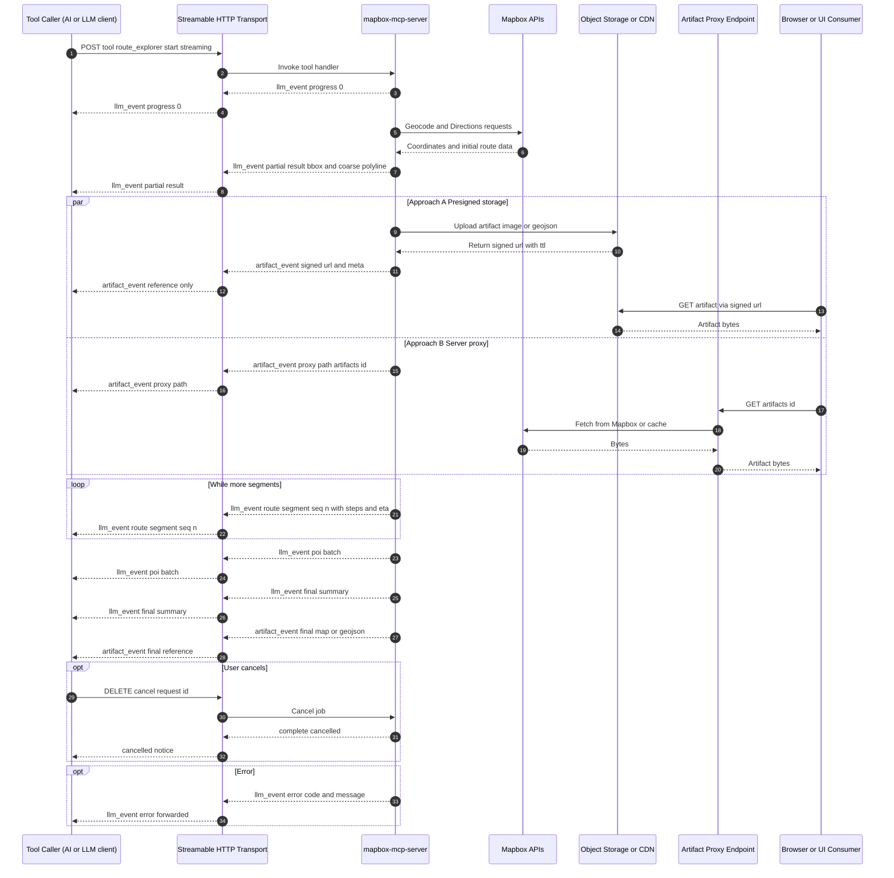

# Add dual-channel streaming: `llm_event` vs `artifact_event` for Route Explorer and similar tools

## Summary

Introduce first-class support for **dual-channel streaming** in `mapbox-mcp-server`:

- **`llm_event`** — small, structured updates that may safely enter an LLM’s context (progress, bbox, encoded polyline, ETA, step summaries, POI batches, final summary).
- **`artifact_event`** — large or binary artifacts (e.g., Mapbox static map images, full GeoJSON, large vectors) intended **only for the UI**, never for the LLM context.

This separation prevents token bloat, allows progressive UX, and aligns with an AI-agent + UI architecture where artifacts are rendered outside the model.

---

## Motivation

- Inlining images or large GeoJSON in a tool’s textual output explodes token usage and can exceed model limits.
- Many UIs need progressive/partial updates immediately (coarse route first, refinements later) while heavy assets are fetched out-of-band.
- Dual-channel streaming enables **fast feedback** and **secure artifact delivery** without polluting the LLM context.

---

## Scope

1. **Protocol additions**: event types, payload shapes, sequencing, and replacement semantics.
2. **Transport**: continue to use streamable HTTP (SSE or chunked); define how both event kinds are emitted.
3. **Server tool API**: helpers for emitting `llm_event` vs `artifact_event`.
4. **Security**: ensure Mapbox tokens never leak to browser; artifacts delivered via signed URLs or server proxy.
5. **Docs + examples**: update README and provide a reference client snippet.
6. **Back-compat**: keep current single-stream behavior behind a flag; default to dual-channel for new tools.

---

## Event Schema (proposed)

```jsonc
// llm_event examples
{ "kind": "llm_event", "type": "progress", "pct": 0 }
{ "kind": "llm_event", "type": "partial_result", "camera": {...}, "bbox": [...], "polyline": "..." }
{ "kind": "llm_event", "type": "route_segment", "seq": 1, "polyline": "...", "steps": [...], "eta": 1234 }
{ "kind": "llm_event", "type": "poi_batch", "seq": 3, "items": [{ "id": "...", "coord": [-78.64, 35.78], "name": "Cafe" }] }
{ "kind": "llm_event", "type": "final_result", "distance_m": 19876, "eta_s": 1260, "profile": "driving" }

// artifact_event examples
{ "kind": "artifact_event", "id": "map-final", "uri": "https://signed.cdn/.../map-final.webp", "mime": "image/webp", "bytes": 146522, "sha256": "8b4d...", "expires_at": "2025-08-12T14:00:00Z" }
{ "kind": "artifact_event", "id": "route-geojson", "uri": "https://signed.cdn/.../r-abc.geojson", "mime": "application/geo+json", "bytes": 50234 }
```

---

## Transport Changes

- Keep a **single HTTP streaming response** for the tool call; emit both kinds of events as NDJSON or SSE lines.
- Add optional **fan-out** hook so servers can forward `artifact_event` to a UI-focused channel (e.g., another SSE topic or WebSocket) without sending them to an LLM client.
- Provide a server option: `includeArtifactsInPrimaryStream: false` (default) to **emit artifact events only as references**.

---

## Artifact Delivery Approaches

### Approach A — Object Storage with Presigned URLs (Recommended)

- Render artifact → upload to S3/GCS → return short-lived presigned URL via `artifact_event`.
- **Pros:** scalable, cacheable, CDN-friendly.
- **Cons:** requires bucket + signing logic.

### Approach B — Server Proxy Fetch (No External Storage)

- Emit `artifact_event` with internal proxy URL → proxy fetches artifact from Mapbox or cache and streams to UI.
- **Pros:** simple ops, no external storage.
- **Cons:** less cacheable, higher server egress.

### Approach C — CDN-backed Content Addressable Store

- Push artifacts to CAS with immutable URLs keyed by SHA-256.
- **Pros:** perfect dedupe, great caching.
- **Cons:** requires CAS/edge setup.

### Approach D — Declarative Rendering (No Binary Artifact)

- Send map rendering instructions via `llm_event`; only create artifact on demand.
- **Pros:** zero artifact traffic during exploration.
- **Cons:** UI must render maps itself.

---

## Mermaid Diagram



---

## Acceptance Criteria

- Server can emit `llm_event` and `artifact_event` with schemas above.
- Artifacts are never inlined into LLM-visible text payloads.
- At least one artifact delivery approach (A or B) implemented and documented.
- Example tool demonstrates coarse-first, refine-later streaming plus final artifact export.
- Tests and README updated.
